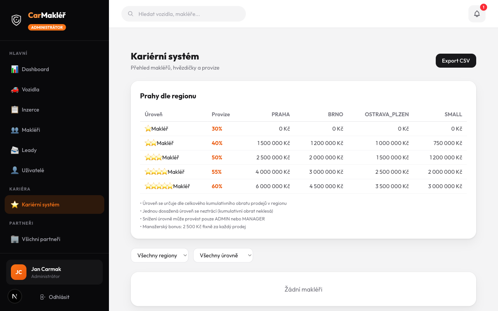
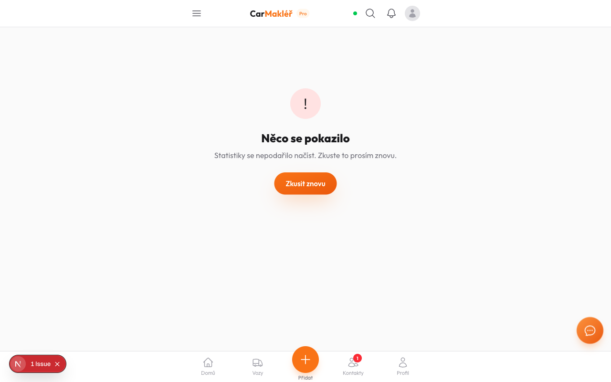
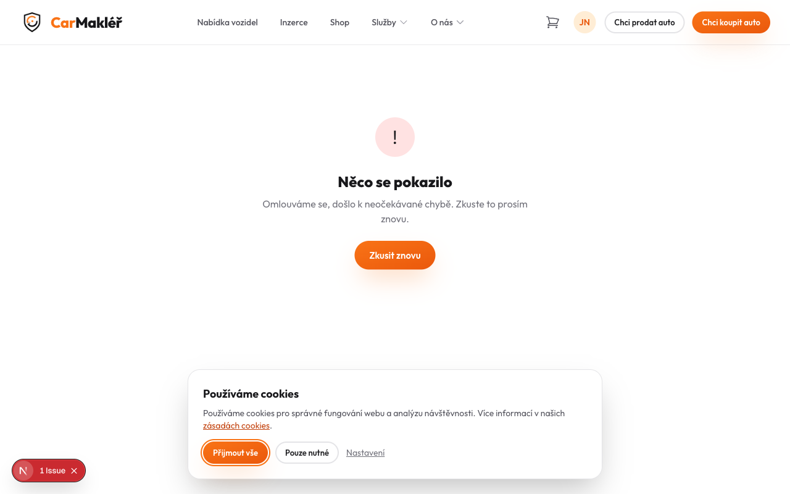
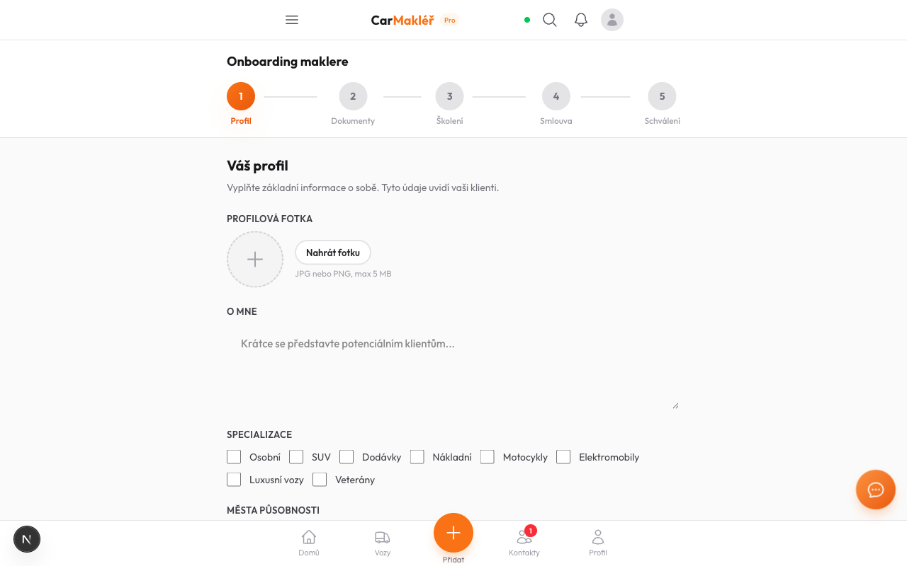
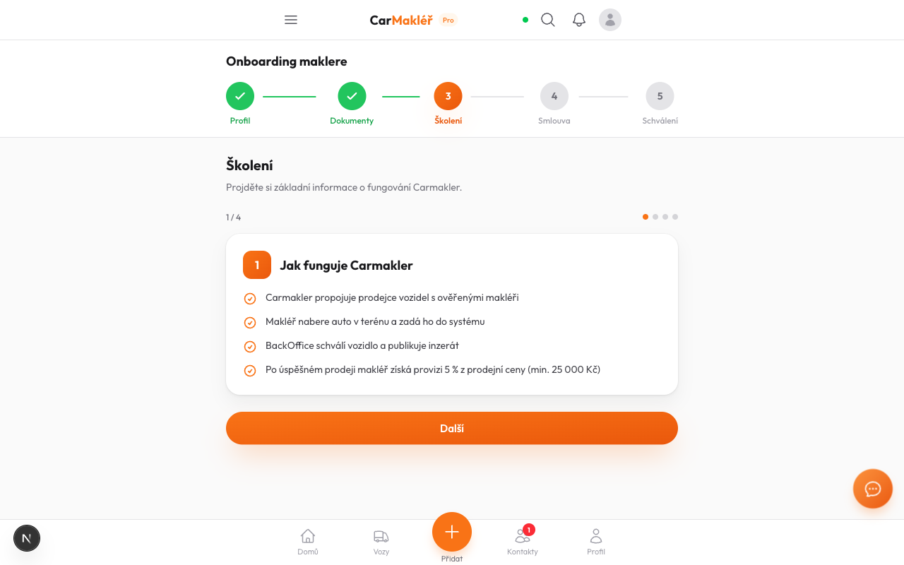

# Chrome Browser Test Report — TASK-044/045/047/048

**Datum:** 2026-04-25  
**Tester:** test-chrome (Playwright headed mode, viditelný Chrome)  
**Dev server:** http://localhost:3000 ✅

---

## Celkový výsledek

| Stránka | Status | Poznámka |
|---------|--------|----------|
| `/admin/career` | ✅ PASS | Tabulka 4 regiony × 5 úrovní |
| `/makler/stats` | ❌ FAIL | Crash — BUG-1 (schema drift) |
| `/profil/[slug]` | ❌ FAIL | Crash — BUG-1 (schema drift) |
| `/registrace/makler` | ✅ PASS | Načte, správná čeština |
| `/makler/onboarding/profile` | ✅ PASS | "Váš profil" ✅ |
| `/makler/onboarding/training` | ✅ PASS | "Školení", "Kvíz" ✅ |

---

## ❌ BUG-1 — Schema drift: `User.totalRevenue` + `BrokerPointTransaction` chybí v DB

**Závažnost:** BLOCKER — 2 stránky crashují

**Stránky postižené:**
- `http://localhost:3000/makler/stats` → "Statistiky se nepodařilo načíst"
- `http://localhost:3000/profil/jan-novak-praha` → "Omlouváme se, došlo k neočekávané chybě"

**Root cause (Prisma error z HTML page source):**
```
PrismaClientValidationError: Unknown field `totalRevenue` for select statement on model `User`.
```

**Ověřeno v DB:**
```
\d "User"   -- totalRevenue: CHYBÍ ❌
\dt         -- BrokerPointTransaction: CHYBÍ ❌
```

**Schema.prisma má:**
```
User.totalRevenue  Int @default(0)    // line 36
model BrokerPointTransaction          // line 1577
```

**Fix:**
```bash
npx prisma migrate dev
# při tsvector drift:
npx prisma migrate reset --force && npx prisma migrate dev
```

---

## TASK-044 — Admin `/admin/career` ✅ PASS



- Nadpis: "Kariérní systém — Přehled makléřů, hvězdičky a provize" ✅
- Tabulka **Prahy dle regionu** — 4 sloupce: PRAHA, BRNO, OSTRAVA_PLZEN, SMALL ✅
- 5 řádků: ⭐30%, ⭐⭐40%, ⭐⭐⭐50%, ⭐⭐⭐⭐55%, ⭐⭐⭐⭐⭐60% ✅
- "Žádní makléři" — seed data nemají regionId (ne bug kódu) ✅
- Tlačítko "Export CSV" ✅
- Auth: 307→login ✅

## TASK-044 — Broker `/makler/stats` ❌ FAIL



"Statistiky se nepodařilo načíst" — viz BUG-1.

## TASK-044 — `/profil/jan-novak-praha` ❌ FAIL



"Omlouváme se, došlo k neočekávané chybě" — viz BUG-1.

---

## TASK-045 — PDF loga (statická analýza)

Nelze otestovat bez existující smlouvy.

- `lib/pdf/logo.ts` čte `public/brand/logo-dark.png` → base64 ✅
- `logo-dark.png` existuje ✅
- PDF route: `doc.addImage(logoData, "PNG", ...)` — bez textu "CARMAKLER" ✅

---

## TASK-047 — `/registrace/makler` ✅ PASS

- HTTP 200, title "Registrace makléře" ✅
- Bez tokenu: "Neplatná pozvánka" (správné) ✅
- Source kód — diakritika: Jméno ✅, Příjmení ✅, Heslo ✅, IČO ✅, Souhlasím ✅

---

## TASK-048 — Onboarding ✅ PASS

### `/makler/onboarding/profile`



- **"Váš profil"** (ne "Vas profil") ✅
- 5-krokový wizard: Profil → Dokumenty → Školení → Smlouva → Schválení ✅
- Formulář: PROFILOVÁ FOTKA, O MNE, SPECIALIZACE, MĚSTA PŮSOBNOSTI ✅

### `/makler/onboarding/training`



- **"Školení"** (ne "Skoleni") ✅
- Krok 3 aktivní, obsah "Jak funguje Carmakler" ✅
- Kvíz přepínání v source: `{showQuiz ? "Kvíz" : "Školení"}` ✅

---

## Potřebné akce

1. **[BLOCKER]** DB migrace — chybí `User.totalRevenue` + tabulka `BrokerPointTransaction`:
   ```bash
   npx prisma migrate dev
   ```
2. **[MINOR]** Seed data mají `level='JUNIOR'` (starý systém). Po migraci bude vše v pořádku.
