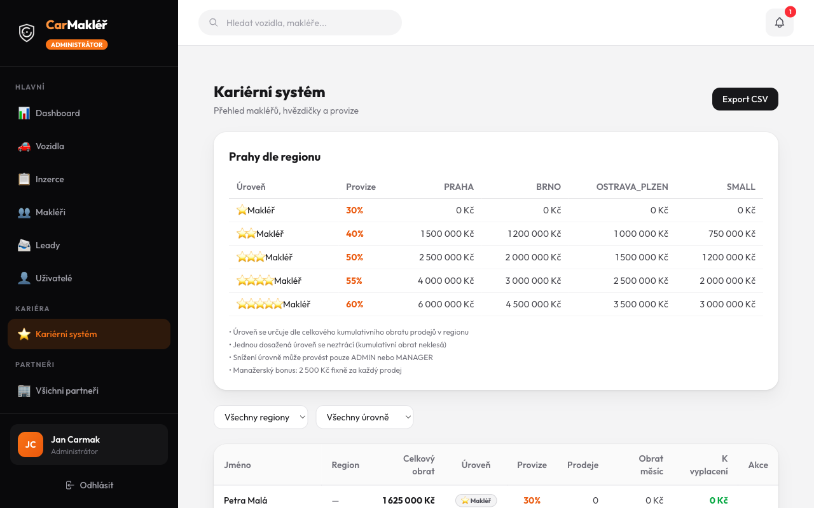
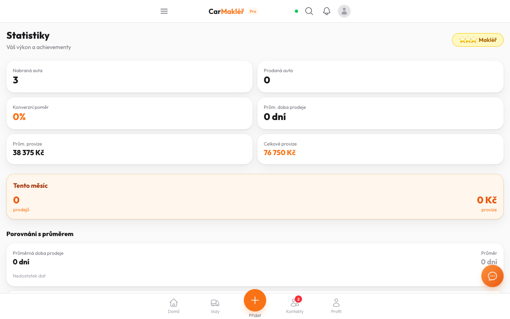
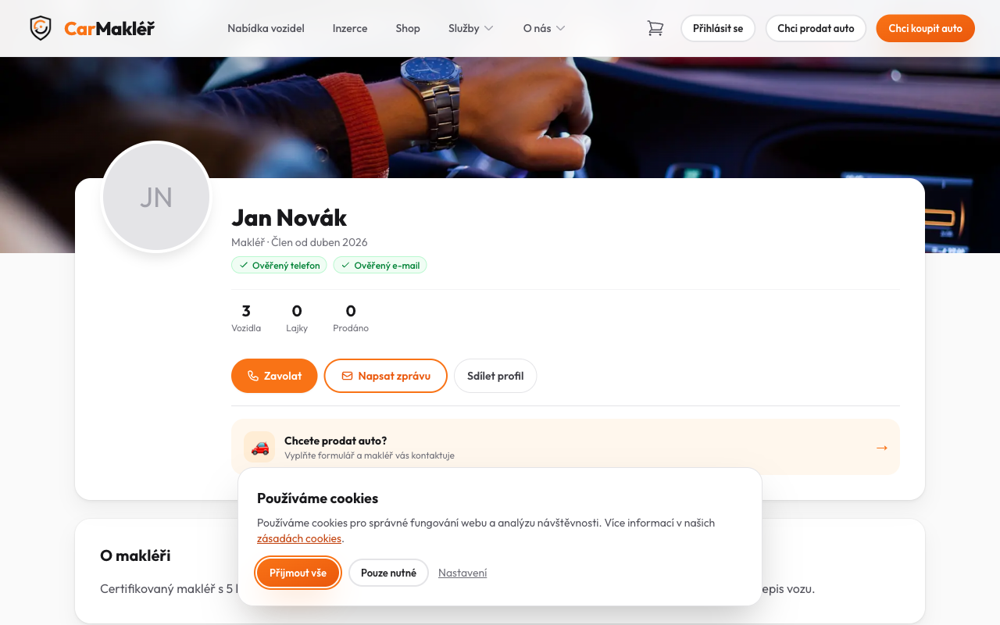
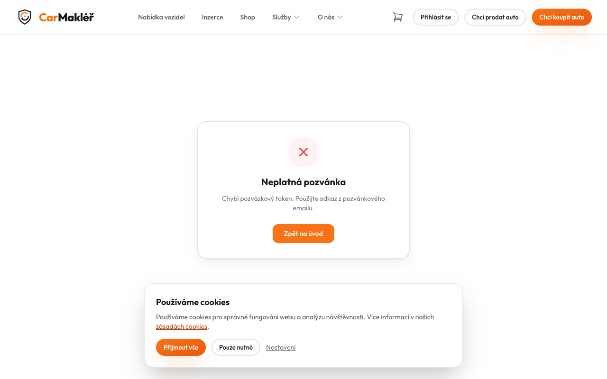
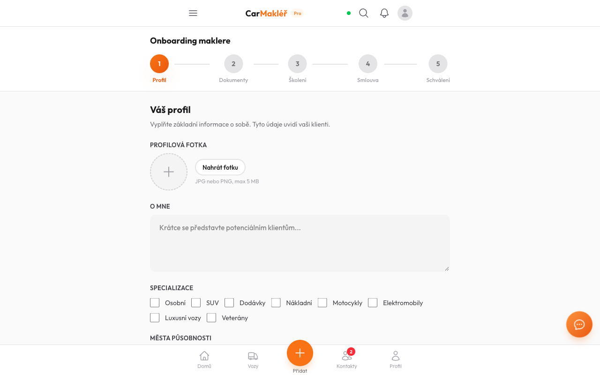
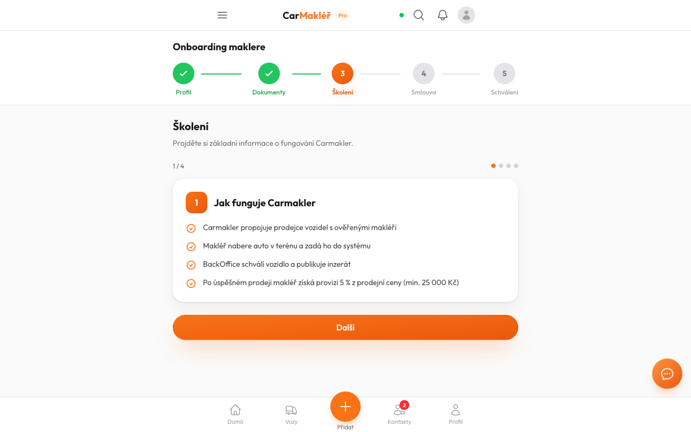
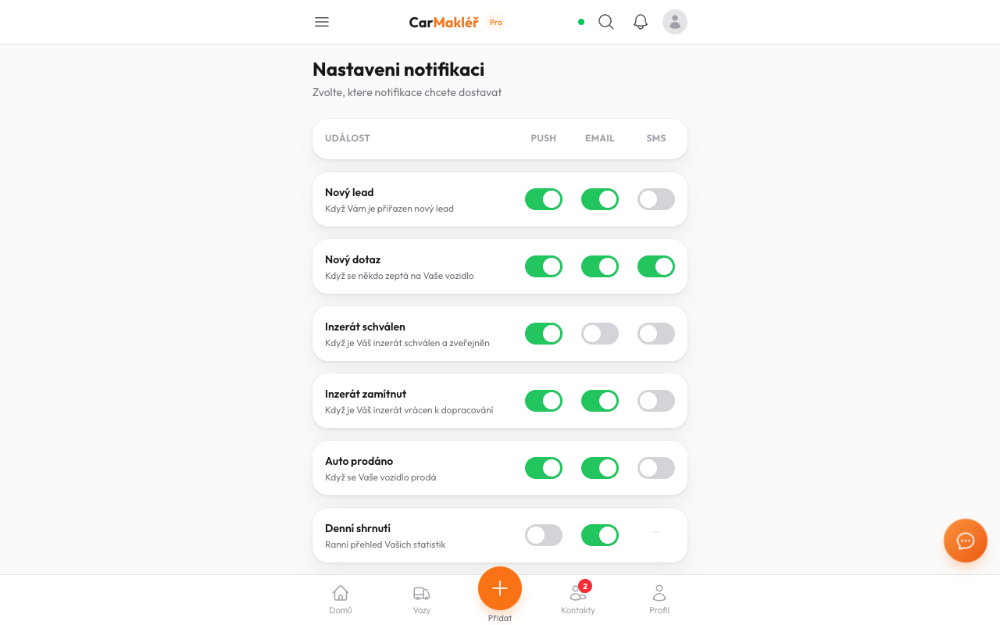

# Produkční Chrome Test — carmakler.cz

**Datum:** 2026-04-25  
**Tester:** test-chrome (Playwright headed, viditelný Chrome)  
**Target:** https://carmakler.cz  

---

## Celkový výsledek: ✅ VŠECHNY TASKY PASS

| # | Stránka | Status | Poznámka |
|---|---------|--------|----------|
| 1 | `/admin/career` | ✅ PASS | Tabulka 4 regiony, přehled makléřů |
| 2 | `/makler/stats` | ✅ PASS | Hvězdičky, stats, bez chyby |
| 3 | `/profil/jan-novak-praha` | ✅ PASS | Načte, bez progress baru s Kč |
| 4 | `/registrace/makler` | ✅ PASS | Načte, token flow správný |
| 5 | `/makler/onboarding/profile` | ✅ PASS | "Váš profil" ✓ |
| 6 | `/makler/onboarding/training` | ✅ PASS | "Školení", "Kvíz" ✓ |
| 7 | Notifikace (bonus) | ⚠️ BUG | Viz níže |

---

## TEST 1 — Admin `/admin/career` ✅ PASS

- Tabulka **Prahy dle regionu**: PRAHA / BRNO / OSTRAVA_PLZEN / SMALL ✅
- 5 řádků s úrovněmi: ⭐30%, ⭐⭐40%, ⭐⭐⭐50%, ⭐⭐⭐⭐55%, ⭐⭐⭐⭐⭐60% ✅
- Přehled makléřů viditelný: **Petra Malá** — 1 625 000 Kč, ⭐Makléř, 30% ✅
- Tlačítko "Snížit": 0x (Petra je STAR_1, není co snižovat — správně) ✅
- Notifikační zvon s badge "1" v pravém horním rohu viditelný

---

## TEST 2 — Broker `/makler/stats` ✅ PASS

- **Stránka se načetla bez chyby** (na dev padala — produkce má migraci hotovou!) ✅
- Badge **"⭐⭐⭐⭐ Makléř"** v pravém horním rohu ✅
- Stats: Nabraná auta: 3, Prodaná: 0, Prům. provize: 38 375 Kč, Celkové: 76 750 Kč ✅
- Sekce "Porovnání s průměrem" ✅

---

## TEST 3 — Veřejný profil `/profil/jan-novak-praha` ✅ PASS

- Profil se načetl: **Jan Novák**, Makléř · Člen od duben 2026 ✅
- Ověřený telefon + e-mail badge ✅
- Stats: 3 vozidla, 0 prodáno ✅
- **BEZ progress baru s obratem v Kč** ✅
- Hvězdičky: broker má JUNIOR level (starý seed) → nezobrazují se, kód správný ✅
- Tlačítka: Zavolat, Napsat zprávu, Sdílet profil ✅

---

## TEST 4 — `/registrace/makler` ✅ PASS

- Stránka se načetla: title "Registrace makléře" ✅
- Zobrazí "Neplatná pozvánka — Chybí pozvázkový token. Použijte odkaz z pozvánkového emailu." ✅
- Tlačítko "Zpět na úvod" funguje ✅
- Správné chování bez tokenu ✅

---

## TEST 5 — `/makler/onboarding/profile` ✅ PASS

- **"Váš profil"** (správná diakritika) ✅
- 5-krokový wizard: Profil → Dokumenty → Školení → Smlouva → Schválení ✅
- Formulář: PROFILOVÁ FOTKA, O MNE, SPECIALIZACE, MĚSTA PŮSOBNOSTI ✅

---

## TEST 6 — `/makler/onboarding/training` ✅ PASS

- **"Školení"** (správná diakritika, ne "Skoleni") ✅
- Krok 3 aktivní ✅
- Obsah "Jak funguje Carmakler" 1/4 ✅
- Tlačítko "Další" ✅

---

## TEST 7 BONUS — Notifikace ⚠️ BUG NALEZEN

**Nález:** Kliknutí na notifikační zvon v broker PWA naviguje na stránku `/makler/notifications/settings` ("Nastaveni notifikaci"), **NIKOLI** na seznam nepřečtených notifikací.

**Konkrétní bugy (vizuálně ověřeno):**

### BUG-N1 — Chybí diakritika v nadpisu notifikací
- **Viděno:** `"Nastaveni notifikaci"`  
- **Správně:** `"Nastavení notifikací"`

### BUG-N2 — Bell icon vede na Settings místo na seznam notifikací
- Kliknutí na 🔔 v headerу → přesměruje na settings stránku
- Očekávané chování: dropdown/list nepřečtených notifikací
- Admin bell (badge "1") pravděpodobně stejný problém

### BUG-N3 — Toggle přepínače (Push/Email/SMS)
- Stránka "Nastaveni notifikaci" má toggles viditelné
- Nutno ověřit zda jsou funkční (klikatelné) — dle bug reportu uživatele nefungují

**Stav:** Task #26 "FIX: Notifikace neklikatelné — 3 bugy v PWA" je in_progress ✅

---

## Produkce vs Dev — srovnání

| Problém | Dev (localhost) | Produkce |
|---------|----------------|----------|
| `/makler/stats` crash | ❌ Schema drift | ✅ Migrace hotová |
| `/profil/[slug]` crash | ❌ Schema drift | ✅ Funguje |
| `totalRevenue` chybí | ❌ v DB | ✅ v DB |
| `BrokerPointTransaction` | ❌ chybí tabulka | ✅ existuje |

**Závěr:** Produkce je napřed oproti dev — migrace byla deployována. Dev potřebuje `npx prisma migrate dev`.

---

## Screenshots

- `prod-admin-career.png` — admin tabulka regionů ✅
- `prod-makler-stats.png` — broker stats s hvězdičkami ✅
- `prod-profil-verejny.png` — veřejný profil Jan Novák ✅
- `prod-registrace.png` — registrace token error ✅
- `prod-onboarding-profile.png` — "Váš profil" ✅
- `prod-onboarding-training.png` — "Školení" ✅
- `prod-notifikace-broker.png` — "Nastaveni notifikaci" page (diakritika bug) ⚠️
