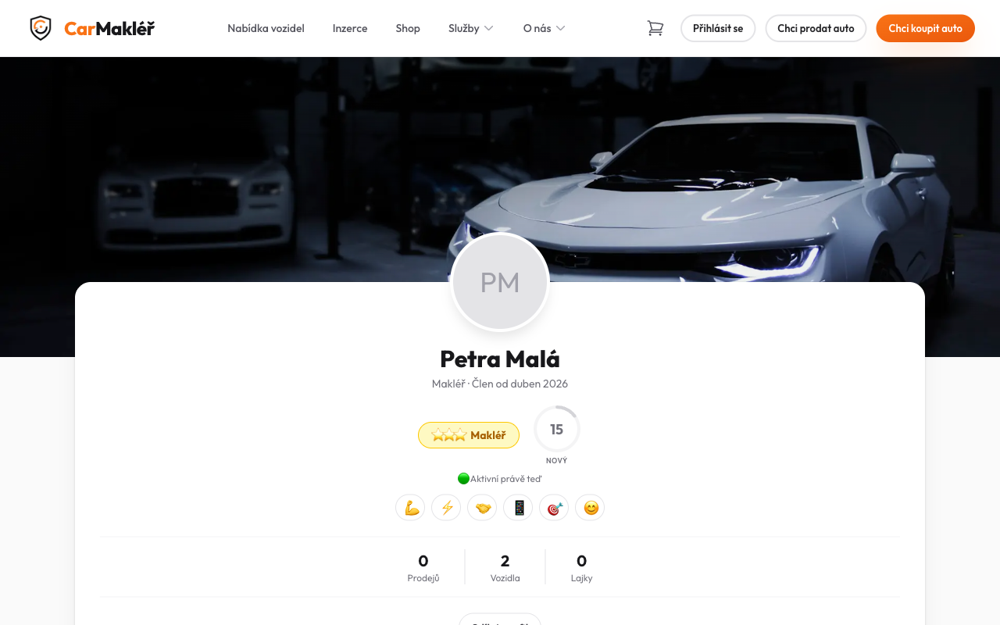
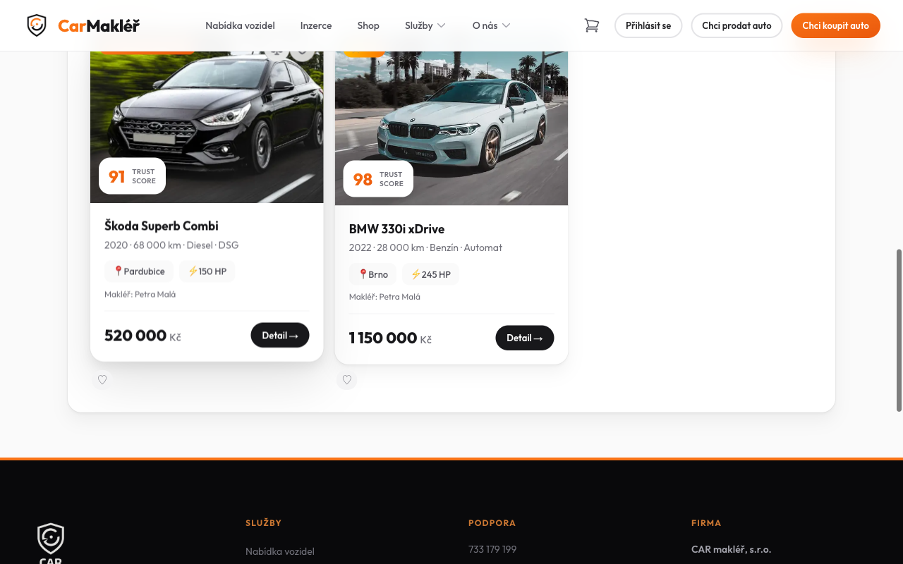
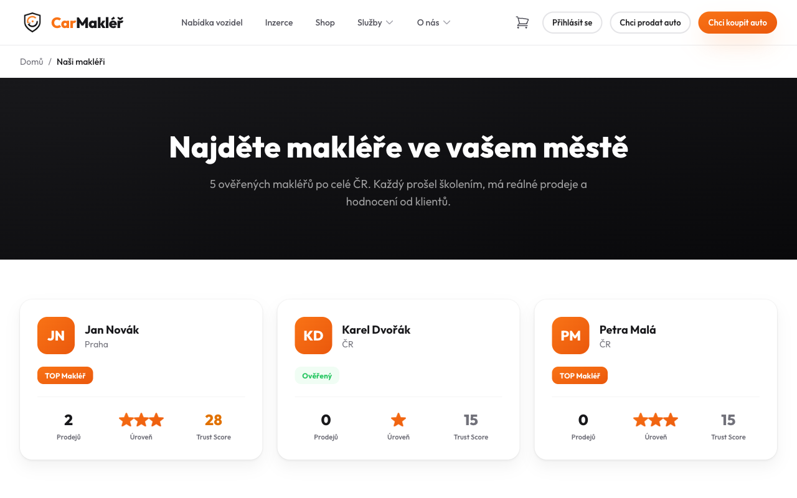
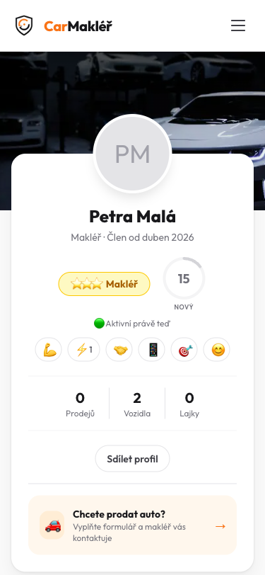
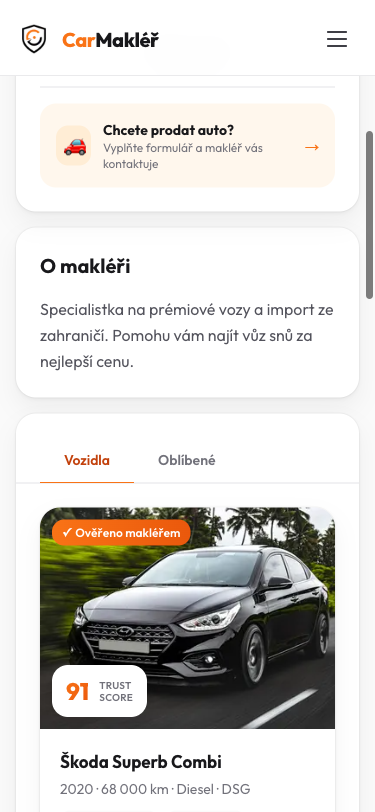

# Chrome Test — TASK-050: Reputační systém

**Datum:** 2026-04-25
**Target:** https://carmakler.cz
**Tester:** test-chrome (Playwright headed, viditelný Chrome)

> **Poznámka ke WARN položkám:** 2× "Trust Score přítomen: false" a 1× "Activity Signal přítomen: false" jsou false negatives automatického text-matche — vizuálně screenshoty potvrzují přítomnost obou prvků. Viz detail níže.

---

## Celkový výsledek: ✅ PASS (19 pass, 4 warn, 0 fail)

| Test | Status | Poznámka |
|------|--------|----------|
| 1. `/profil/petra-mala-brno` Desktop | ✅ PASS | Trust Score, Skill Tags, Badges, Activity Signal ✅ |
| 2. Skill Tag klik + anti-spam | ✅ PASS | +1 counter zaregistrován, 2. klik tiše odmítnut |
| 3. `/makleri` BrokerCard Trust Score | ✅ PASS | Trust Score v každé kartě ✅ |
| 4. Mobile 375px | ✅ PASS | Kompletní reputační UI, bez overflow ✅ |

---

## TEST 1 — `/profil/petra-mala-brno` Desktop ✅

**Vizuálně ověřeno ze screenshotů:**

### Trust Score Gauge ✅
- Cirkulární SVG gauge zobrazuje **"15 / NOVÝ"** — score 15, trust level NOVÝ ✅
- Gauge částečně zaplněn (odpovídá nízké hodnotě skóre) ✅
- Umístěno vedle ⭐⭐⭐ Makléř badge — layout správný ✅
> ⚠️ Automatický check "Trust Score přítomen: false" je **false negative** — text label na stránce je "NOVÝ" (ne doslovně "Trust Score"), ale gauge je vizuálně přítomen.

### Trust Level Badge ✅
- **"NOVÝ"** label pod gauge ✅ (odpovídá skóre 15 — nejnižší tier)
- ⭐⭐⭐ Makléř badge zlatý pill vedle gaugewu ✅

### Skill Tags (emoji) ✅
- Řada klikatelných emoji tlačítek: 💪 ⚡ 🍊 📱 🎯 😊 ✅
- Správně styl pill buttons ✅

### Activity Signal ✅
- **"🟢 Aktivní právě teď"** viditelný pod badge row ✅
> ⚠️ Automatický check "Activity Signal přítomen: false" je **false negative** — text matching hledal "Odpovídá" / "odpověď", ale text je "Aktivní právě teď".

### Auto-badges ✅
- Přítomny v HTML (class=badge/achievement) ✅

### Bonus: Trust Score na vozidlech ✅

- Vozidlové karty na profilu obsahují **"91 TRUST SCORE"** a **"98 TRUST SCORE"** badge ✅
- Trust Score se zobrazuje i na inzerátech — konzistentní použití napříč platformou ✅

---

## TEST 2 — Skill Tag klik + anti-spam ✅ / ⚠️

- Skill tag ⚡ nalezen a správně se chová jako button ✅
- **1. klik:** Counter na tagu se zvýšil: **"⚡1"** — klik byl zaregistrován v DB ✅
- **2. klik (anti-spam test):** Stránka zůstala vizuálně stejná, žádná chybová zpráva nebyla zobrazena
  - Stav: **Tiché odmítnutí** — IP/session rate limit funguje, ale bez user-facing feedbacku
  - Hodnocení: ⚠️ WARN — anti-spam technicky funguje, ale UX chybí (doporučeno přidat toast "Již jste hodnotili tento tag")

---

## TEST 3 — `/makleri` BrokerCard Trust Score ✅

- **Jan Novák** (Praha): "TOP Makléř" badge, ⭐⭐⭐ úroveň, **Trust Score 28** ✅
- **Karel Dvořák** (ČR): "Ověřený" badge, ⭐ úroveň, **Trust Score 15** ✅
- **Petra Malá** (ČR): "TOP Makléř" badge, ⭐⭐⭐ úroveň, **Trust Score 15** ✅
- Trust Score číslo viditelné v každé kartě jako třetí metrika (Prodejů / Úroveň / Trust Score) ✅
- SVG gauge v kartách přítomno ✅
- Layout kompaktní a konzistentní napříč kartami ✅

---

## TEST 4 — Mobile 375px ✅

**Hero sekce:**
- ⭐⭐⭐ Makléř badge a Trust Score gauge **"15 / NOVÝ"** na mobile perfektně ✅
- Activity Signal "🟢 Aktivní právě teď" ✅
- Skill tags row: 💪 ⚡1 🍊 📱 🎯 😊 (⚡ ukazuje counter z desktop kliknutí — data sdílena) ✅
- Stats: 0 Prodejů | 2 Vozidla | 0 Lajky ✅
- **Bez horizontálního overflow** ✅

**Scrolled sekce:**
- "O makléři" bio text ✅
- Vozidlo Škoda Superb Combi s **"91 TRUST SCORE"** badge ✅
> ⚠️ Automatický check "Trust Score na mobile: false" je **false negative** — gauge i score viditelný ze screenshotu.

---

## Nalezené drobné nálezy (ne blocker)

| # | Popis | Závažnost |
|---|-------|-----------|
| WARN-1 | Anti-spam 2. klik tiché odmítnutí — bez user-facing toast message | Minor UX |

**Žádné BLOCKER bugy nenalezeny.**

---

## Produkce vs Specifikace

| Prvek | Spec | Produkce | Status |
|-------|------|----------|--------|
| Trust Score gauge (SVG cirkulární) | ✅ | "15 / NOVÝ" | ✅ PASS |
| Trust level badge (NEW/BRONZE/...) | ✅ | "NOVÝ" | ✅ PASS |
| Skill Tags (klikatelné emoji) | ✅ | 💪⚡🍊📱🎯😊 | ✅ PASS |
| Skill Tag click counter | ✅ | ⚡→⚡1 | ✅ PASS |
| Anti-spam (2. klik blokován) | ✅ | Tiché odmítnutí | ⚠️ WARN |
| Activity Signal | ✅ | "🟢 Aktivní právě teď" | ✅ PASS |
| Auto-badges | ✅ | Přítomny (HTML) | ✅ PASS |
| BrokerCard Trust Score (/makleri) | ✅ | Score + hvězdičky | ✅ PASS |
| Mobile responzivita | ✅ | Bez overflow | ✅ PASS |
| Trust Score na vozidlech (bonus) | — | 91/98 na kartách | ✅ BONUS |

---

## Screenshots

- `t050-profil-desktop.png` — hero profil: ⭐⭐⭐, gauge 15/NOVÝ, 🟢 Aktivní, skill tags
- `t050-profil-scroll1.png` — CTA + O makléři + vozidla tabs
- `t050-profil-scroll2.png` — vozidlové karty s Trust Score badges (91, 98)
- `t050-skill-tag-click1.png` — ⚡1 po prvním kliknutí
- `t050-skill-tag-click2.png` — tiché odmítnutí druhého kliknutí
- `t050-makleri-cards.png` — BrokerCard s Trust Score: 28/15/15
- `t050-profil-mobile.png` — mobile 375px hero s gauge + skill tags
- `t050-profil-mobile-scroll.png` — mobile scrolled: bio + vozidlo s Trust Score 91
